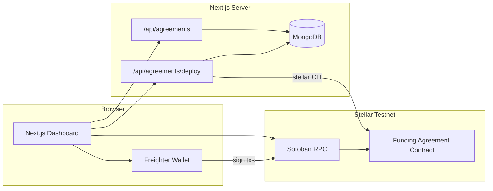

# Aestrial Impact Protocol

Institutional funding agreements on **Stellar Soroban**, with a Next.js dashboard, Freighter wallet integration, MongoDB agreement indexing, and real **XLM testnet** milestone donations.

This repository contains:

- A **Soroban smart contract** (`funding-agreement`) for agreement lifecycle and milestones
- A **Next.js frontend** for operators, funders, and grantees
- **Makefile** automation for build, deploy, and CLI interaction
- **MongoDB** off-chain index for deployed agreement contract IDs and metadata

---

## Table of contents

- [Overview](#overview)
- [Architecture](#architecture)
- [Features](#features)
- [Prerequisites](#prerequisites)
- [Project structure](#project-structure)
- [Environment setup](#environment-setup)
- [Smart contract (CLI)](#smart-contract-cli)
- [Frontend](#frontend)
- [End-to-end workflow](#end-to-end-workflow)
- [API routes](#api-routes)
- [Documentation](#documentation)
- [Security notes](#security-notes)
- [Troubleshooting](#troubleshooting)

---

## Overview

**Aestrial Impact Protocol** models grant-style funding as on-chain **Funding Agreements**:

- Each agreement has roles: **Factory**, **Funder**, **Grantee**, **Arbiter**
- Work is split into **milestones** with amounts and metadata URIs
- The contract manages **state**, **permissions**, and **events**
- Payments are sent as native **XLM** to the grantee (not inside the contract)
- Agreement instances are **indexed in MongoDB** for discovery in the UI

The contract follows the interface in [`SCOPE.md`](SCOPE.md) and the storage layout in [`STORAGE.md`](STORAGE.md).

---

## Architecture



| Layer | Responsibility |
|--------|----------------|
| **Soroban contract** | Agreement state, milestones, roles, events |
| **Frontend** | Dashboard, wallet signing, donations, agreement creation UI |
| **MongoDB** | Index of deployed contract IDs, titles, organizations, milestone metadata |
| **Stellar CLI** | Used by the deploy API route to build/deploy/initialize contracts |

---

## Features

### Smart contract

- Initialize agreement with dynamic milestones
- Lifecycle: Draft → Active → Paused → Completed / Cancelled / Archived
- Milestone flow: Pending → Submitted → Approved / Rejected → Completed
- Role-based authorization and contract events
- Query API: agreement, status, milestones, participants, config

### Frontend dashboard

- **Dashboard**: live agreement status, milestone progress, lifecycle actions
- **Funding Agreements**: deploy + initialize + index new agreements from the UI
- **Organizations / Disbursements**: placeholder sections for future modules
- **Freighter** connect and transaction signing
- **XLM donations** to grantee with memo `milestone:<id>` on testnet
- Auto-refresh of on-chain and indexed data (React Query + `no-store` API cache)

---

## Prerequisites

| Tool | Purpose |
|------|---------|
| [Rust](https://rustup.rs/) | Build Soroban contract |
| [Stellar CLI](https://developers.stellar.org/docs/tools/cli) | `stellar contract build/deploy/invoke` |
| [Node.js](https://nodejs.org/) 20+ | Frontend and API routes |
| [Freighter](https://www.freighter.app/) | Browser wallet (testnet) |
| [MongoDB Atlas](https://www.mongodb.com/atlas) or local MongoDB | Agreement index |
| Testnet XLM | [Stellar testnet faucet](https://laboratory.stellar.org/#account-creator) |

Verify CLI:

```bash
stellar --version
cargo --version
node --version
```

---

## Project structure

```
ong/
├── src/lib.rs              # Soroban Funding Agreement contract
├── Cargo.toml
├── Makefile                # Build, deploy, invoke helpers
├── .env                    # CLI secrets (SECRET_KEY, OWNER_ADDRESS, MongoDB)
├── SCOPE.md                # Public contract interface spec
├── STORAGE.md              # On-chain storage model
├── DESIGN.md               # UI design system
├── FRONTEND.md             # Frontend architecture guide
└── frontend/
    ├── app/                # Next.js App Router
    │   └── api/agreements/ # MongoDB + deploy routes
    ├── features/dashboard/ # Main dashboard UI
    ├── contracts/funding-agreement/  # Generated TypeScript bindings
    ├── hooks/              # React Query hooks
    ├── services/           # Contract, donation, index services
    ├── providers/          # Wallet, Soroban, Query providers
    └── .env.local          # Frontend env (copy from .env.example)
```

---

## Environment setup

### Root `.env` (contract CLI + deploy API)

Create `ong/.env`:

```env
RPC_URL=https://soroban-testnet.stellar.org
NETWORK_PASSPHRASE=Test SDF Network ; September 2015
SECRET_KEY=S...                          # Testnet secret key (never commit)
OWNER_ADDRESS=G...                       # Default factory/funder/grantee/arbiter
MONGODB_URI=mongodb+srv://.../impact_protocol?retryWrites=true&w=majority
MONGODB_DB=impact_protocol
```

> The deploy API route reads this file to sign transactions with `SECRET_KEY` and default participant addresses.

### Frontend `.env.local`

Create `frontend/.env.local` from [`frontend/.env.example`](frontend/.env.example):

```env
NEXT_PUBLIC_STELLAR_NETWORK=testnet
NEXT_PUBLIC_STELLAR_RPC_URL=https://soroban-testnet.stellar.org
NEXT_PUBLIC_FUNDING_AGREEMENT_CONTRACT_ID=C...
MONGODB_URI=mongodb+srv://.../impact_protocol?retryWrites=true&w=majority
MONGODB_DB=impact_protocol
```

| Variable | Description |
|----------|-------------|
| `SECRET_KEY` | Signs CLI and server-side deploy transactions |
| `OWNER_ADDRESS` | Default Stellar public key for roles |
| `NEXT_PUBLIC_FUNDING_AGREEMENT_CONTRACT_ID` | Default contract loaded on dashboard startup |
| `MONGODB_URI` / `MONGODB_DB` | Agreement index database |

---

## Smart contract (CLI)

All commands run from the repository root.

```bash
make help          # List available targets
make test          # Run Rust unit tests
make fmt           # Format Rust code
make build         # Build WASM
make bindings      # Generate TypeScript client → frontend/contracts/funding-agreement
make deploy        # Deploy to testnet (prints new contract ID)
make init          # Initialize deployed contract with milestones
```

### Deploy and initialize manually

```bash
make deploy
# Copy the contract ID from output

make init CONTRACT_ID=C... \
  METADATA_URI=ipfs://agreement \
  MILESTONES='[["100","ipfs://milestone-0"],["250","ipfs://milestone-1"]]'
```

### Common queries

```bash
make get-agreement CONTRACT_ID=C...
make get-status CONTRACT_ID=C...
make get-milestones CONTRACT_ID=C...
make get-milestone CONTRACT_ID=C... ID=0
```

### Lifecycle commands

```bash
make activate CONTRACT_ID=C...
make pause CONTRACT_ID=C...
make resume CONTRACT_ID=C...
make submit-milestone CONTRACT_ID=C... ID=0
make approve-milestone CONTRACT_ID=C... ID=0
make complete-milestone CONTRACT_ID=C... ID=0
```

### Regenerate frontend bindings

After changing the contract:

```bash
make bindings
```

---

## Frontend

```bash
cd frontend
npm install
npm run dev
```

Open [http://localhost:3000](http://localhost:3000).

### Scripts

| Command | Description |
|---------|-------------|
| `npm run dev` | Development server |
| `npm run build` | Production build |
| `npm run start` | Run production server |
| `npm run lint` | ESLint |

### Wallet setup

1. Install **Freighter**
2. Switch network to **Testnet**
3. Fund the account with testnet XLM
4. Click **Connect Wallet** in the dashboard header

### UI sections

| Section | Description |
|---------|-------------|
| **Dashboard** | Active agreement, milestones, lifecycle buttons, XLM donations |
| **Funding Agreements** | List indexed agreements, create new ones, sort by date/title/org |
| **Organizations** | Mock registry (future module) |
| **Disbursements** | Mock settlement queue (future module) |

---

## End-to-end workflow

### 1. Create a new agreement (recommended — from UI)

1. Go to **Funding Agreements**
2. Fill title, organization, metadata URI, optional donation receiver (grantee)
3. Add dynamic milestones (amount + metadata URI)
4. Click **Deploy + Initialize + Index**
5. The app will:
   - Build and deploy the contract via Stellar CLI
   - Initialize it with your milestones
   - Save the contract ID to MongoDB
   - Switch the dashboard to the new contract

**Requirements:** `stellar` CLI in PATH, root `.env` with `SECRET_KEY` and `OWNER_ADDRESS`, MongoDB configured in `frontend/.env.local`.

### 2. Operate an agreement

1. Open **Dashboard** (or click an agreement in the list)
2. **Activate** when status is Draft
3. Run milestone actions: Submit → Approve → Complete
4. **Donate XLM** to milestones (sends testnet payment to grantee)

### 3. CLI-only workflow

```bash
make deploy
make init CONTRACT_ID=C...
make activate CONTRACT_ID=C...
make get-milestones CONTRACT_ID=C...
```

Then set `NEXT_PUBLIC_FUNDING_AGREEMENT_CONTRACT_ID` in `frontend/.env.local` and restart the dev server.

---

## API routes

| Route | Method | Description |
|-------|--------|-------------|
| `/api/agreements` | `GET` | List indexed agreements (newest first) |
| `/api/agreements` | `POST` | Upsert agreement metadata |
| `/api/agreements/deploy` | `POST` | Build, deploy, initialize, and index a new agreement |

Deploy request body example:

```json
{
  "title": "Water Access Cohort",
  "organization": "Pulso Foundation",
  "metadataUri": "ipfs://agreement",
  "grantee": "G...",
  "milestones": [
    { "id": 0, "amount": "100", "metadataUri": "ipfs://milestone-0" },
    { "id": 1, "amount": "250", "metadataUri": "ipfs://milestone-1" }
  ]
}
```

All agreement routes use `dynamic = "force-dynamic"` and `Cache-Control: no-store`.

---

## Documentation

| File | Contents |
|------|----------|
| [`SCOPE.md`](SCOPE.md) | Contract public interface, roles, states, events |
| [`STORAGE.md`](STORAGE.md) | On-chain storage keys and data structures |
| [`FRONTEND.md`](FRONTEND.md) | Frontend layers, providers, hooks, services |
| [`DESIGN.md`](DESIGN.md) | Dark institutional UI theme and components |

---

## Security notes

- **Never commit** `.env` or `frontend/.env.local`
- Use **testnet keys only** for development
- Rotate credentials if they were exposed in chat or logs
- `SECRET_KEY` is used server-side by the deploy route — restrict production access
- Donations are native XLM payments; the contract does not custody funds

---

## Troubleshooting

### `make init` fails with missing addresses

Ensure `OWNER_ADDRESS` (or `PUBLIC_KEY`) is set in root `.env`.

### WASM not found on deploy

The Makefile sets `CARGO_TARGET_DIR=target`. Run `make build` first. WASM path:

```
target/wasm32v1-none/release/funding_agreement.wasm
```

### Activate button disabled

The agreement may already be **Active** on-chain. Only **Draft** agreements can be activated. Use Pause/Resume when appropriate.

### MongoDB index unavailable

Set `MONGODB_URI` and `MONGODB_DB` in `frontend/.env.local` and restart `npm run dev`.

### Deploy from UI fails

- Confirm `stellar` is installed and on PATH
- Check root `.env` has valid `SECRET_KEY` and funded testnet account
- Check terminal/server logs for CLI errors

### Donations fail

- Connect Freighter on **testnet**
- Ensure wallet has testnet XLM
- Grantee address must be a valid `G...` account

### Transaction simulation `Error(Contract, #4)`

Usually **InvalidState** — the action is not allowed in the current agreement or milestone status.

---

## License

Hackathon / MVP project. Add a license file before public release if needed.
